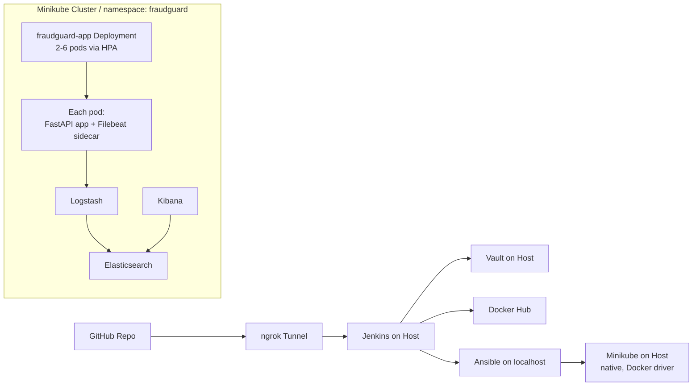

# FraudGuard DevOps Platform


**A production-style MLOps and DevOps pipeline for real-time fraud detection using FastAPI, Kubernetes, CI/CD automation, and observability.**

---

## 1) Architecture Overview



**Log flow:** Filebeat -> Logstash -> Elasticsearch <- Kibana

---

## 2) System Specifications

- **Host:** ASUS TUF Gaming F15
- **OS:** Ubuntu 24.04 LTS
- **CPU:** Intel Core i7-12700H (20 threads, up to 4.7 GHz)
- **RAM:** 16 GB DDR4
- **GPU:** NVIDIA RTX 3050 (not used; model is CPU-only Random Forest)
- **Disk:** ~150 GB free on 955 GB NVMe SSD
- **Kubernetes runtime:** Minikube running natively on host (no VM/VirtualBox)

---

## 3) Tech Stack

| Tool | Version | Purpose |
|---|---|---|
| Ubuntu | 24.04 LTS | Host operating system |
| Python | 3.12 | Backend API, ML inference, automation scripts |
| FastAPI | (project dependency) | Low-latency REST API for fraud prediction |
| scikit-learn | 1.4.2 | Random Forest training and inference |
| Docker | (host install) | Image build/runtime for app and supporting services |
| Jenkins | (host install) | CI/CD orchestration with 7-stage pipeline |
| Ansible | (host install) | Localhost provisioning and deployment automation |
| Minikube / Kubernetes | Minikube + K8s v1.29.0 | Native local cluster for deployment and scaling |
| HashiCorp Vault | dev mode on host | Secrets management (Docker Hub, kubeconfig) |
| ngrok | (host install) | Public webhook tunnel to local Jenkins |
| ELK Stack | 8.13.0 | Centralized logging and observability |
| Newman | (project usage) | Automated Postman smoke testing |
| Locust | >= 2.24.0 | Load testing and HPA verification |

---

## 4) ML Model

- **Dataset:** IEEE-CIS Fraud Detection (Kaggle 2019), **590,540** records
- **Algorithm:** `RandomForestClassifier`
  - `n_estimators=100`
  - `max_depth=20`
  - `class_weight='balanced'`
  - `random_state=42`
- **Performance:** **ROC-AUC = 0.9520** (target threshold >= 0.85)
- **Compute profile:** CPU-only training/inference, no GPU required

---

## 5) Quick Start (Clean Clone)

### Step 1 - Clone and pull LFS model artifact

```bash
git clone https://github.com/kautilyasingh07/fraudguard-devops.git
cd fraudguard-devops
git lfs install
git lfs pull
```

### Step 2 - Start Vault dev server and seed secrets

```bash
# Terminal 1: start Vault dev server
export VAULT_ADDR="http://127.0.0.1:8200"
vault server -dev -dev-root-token-id=root
```

```bash
# Terminal 2: authenticate and seed secrets
export VAULT_ADDR="http://127.0.0.1:8200"
vault login root

# Docker Hub credentials for Jenkins Stage 4
vault kv put secret/dockerhub \
  username="DOCKERHUB_USER" \
  password="DOCKERHUB_PASSWORD"

# kubeconfig for Jenkins Stage 6 (base64-encoded content)
vault kv put secret/kubeconfig \
  config="$(base64 -w 0 ~/.kube/config)"
```

### Step 3 - Provision localhost environment via Ansible

```bash
ansible-playbook ansible/site.yml -i ansible/inventory/hosts.ini -K
```

### Step 4 - Apply Kubernetes manifests

```bash
kubectl apply -f k8s/ --recursive -n fraudguard
kubectl get all -n fraudguard
```

### Step 5 - Configure Jenkins, ngrok, and GitHub webhook

1. Start Jenkins on host and create pipeline job from repository `Jenkinsfile`.
2. Install/enable required plugins (Pipeline, Git, Docker Pipeline, Vault, JUnit, Workspace Cleanup).
3. Start ngrok tunnel to Jenkins:
   ```bash
   ngrok http 8080
   ```
4. In GitHub repository settings, add webhook:
   - Payload URL: `https://<ngrok-id>.ngrok-free.app/github-webhook/`
   - Content type: `application/json`
   - Event: push

### Step 6 - Trigger full CI/CD pipeline

```bash
git checkout -b test-pipeline
echo "# trigger" >> README.md
git add README.md
git commit -m "trigger pipeline"
git push origin test-pipeline
```

Pipeline flow: checkout -> test -> build -> push -> ansible -> deploy -> smoke test.

---

## 6) API Reference

### POST `/predict`

Predict whether a transaction is fraudulent.

> Note: Current backend schema also requires `TransactionDT`.

```bash
curl -X POST "http://localhost:30080/predict" \
  -H "Content-Type: application/json" \
  -d '{
    "TransactionAmt": 1500.0,
    "TransactionDT": 90986,
    "ProductCD": "W",
    "card1": 9500,
    "card2": 117.0,
    "card3": 150.0,
    "card4": "visa",
    "card5": 226.0,
    "card6": "debit",
    "addr1": 299.0,
    "addr2": 87.0,
    "dist1": 0.0,
    "P_emaildomain": "gmail.com",
    "R_emaildomain": "gmail.com",
    "V1": 1.0,
    "V2": 1.0,
    "V3": 1.0,
    "V4": 1.0,
    "V5": 1.0,
    "V6": 1.0,
    "V7": 1.0,
    "V8": 0.0,
    "V9": 0.0,
    "V10": 0.0,
    "V11": 0.0,
    "V12": 1.0,
    "V13": 1.0,
    "V14": 1.0,
    "V15": 0.0,
    "V16": 0.0,
    "V17": 0.0
  }'
```

### GET `/health`

Service and model readiness endpoint.

Example response:

```json
{
  "status": "healthy",
  "model_loaded": true
}
```

### GET `/metrics`

Prometheus scrape endpoint (application metrics).

### GET `/docs`

Swagger UI for interactive API testing.

---

## 7) Jenkins Pipeline Stages

| Stage | Description | Exit Criterion |
|---|---|---|
| 1. Checkout | Pull source and capture short commit SHA | Repository checkout succeeds and `GIT_COMMIT_SHORT` is set |
| 2. Unit Test | Create venv, install deps, run pytest with coverage gate | Tests pass and coverage >= 70%; JUnit report published |
| 3. Docker Build | Build image using BuildKit + cache-from latest | Image builds successfully and `docker inspect` passes |
| 4. Docker Push | Fetch Docker Hub credentials from Vault and push tags | Login and push of `latest` + commit tag succeed; logout executed |
| 5. Ansible Provision | Run localhost Ansible provisioning and k8s apply logic | Playbook completes without failed tasks |
| 6. Kubernetes Deploy | Fetch kubeconfig from Vault and rollout new image | Rollout succeeds within timeout, else rollback + fail |
| 7. Newman Smoke Test | Health warm-up + Postman collection run via Newman | Failures mark stage UNSTABLE, JUnit report published |

---

## 8) Directory Structure (Current Project Tree)

```text
fraudguard-devops/
├── .coverage
├── .dockerignore
├── .gitattributes
├── .gitignore
├── .pytest_cache/
│   ├── .gitignore
│   ├── CACHEDIR.TAG
│   ├── README.md
│   └── v/
│       └── cache/
│           ├── lastfailed
│           └── nodeids
├── Jenkinsfile
├── README.md
├── __pycache__/
│   └── locustfile.cpython-312.pyc
├── ansible/
│   ├── inventory/
│   │   ├── group_vars/
│   │   │   ├── .gitkeep
│   │   │   └── fraudguard_host.yml
│   │   └── hosts.ini
│   ├── roles/
│   │   ├── common/
│   │   │   └── tasks/
│   │   │       ├── .gitkeep
│   │   │       └── main.yml
│   │   ├── docker/
│   │   │   ├── handlers/
│   │   │   │   ├── .gitkeep
│   │   │   │   └── main.yml
│   │   │   └── tasks/
│   │   │       ├── .gitkeep
│   │   │       └── main.yml
│   │   └── kubernetes/
│   │       └── tasks/
│   │           ├── .gitkeep
│   │           └── main.yml
│   └── site.yml
├── app/
│   ├── __init__.py
│   ├── __pycache__/
│   │   ├── __init__.cpython-312.pyc
│   │   ├── logging_config.cpython-312.pyc
│   │   ├── main.cpython-312.pyc
│   │   ├── model.cpython-312.pyc
│   │   └── schemas.cpython-312.pyc
│   ├── logging_config.py
│   ├── logs/
│   │   └── fraud.log
│   ├── main.py
│   ├── model.pkl
│   ├── model.py
│   ├── requirements.txt
│   ├── schemas.py
│   └── train.py
├── data/
│   ├── sample_submission.csv
│   ├── test_identity.csv
│   ├── test_transaction.csv
│   ├── train_identity.csv
│   └── train_transaction.csv
├── docker/
│   ├── Dockerfile
│   └── docker-compose.yml
├── jenkins-cli.jar
├── jenkins-cli.jar.1
├── k8s/
│   ├── deployment.yaml
│   ├── elk/
│   │   ├── .gitkeep
│   │   ├── elasticsearch.yaml
│   │   ├── kibana.yaml
│   │   └── logstash.yaml
│   ├── namespace.yaml
│   └── service.yaml
├── kibana/
│   └── .gitkeep
├── locustfile.py
├── newman-results.xml
├── pyproject.toml
├── requirements-locust.txt
├── test-results.xml
└── tests/
    ├── __pycache__/
    │   ├── conftest.cpython-312-pytest-9.0.2.pyc
    │   └── test_predict.cpython-312-pytest-9.0.2.pyc
    ├── conftest.py
    ├── postman/
    │   ├── .gitkeep
    │   ├── FraudGuard.postman_collection.json
    │   └── FraudGuard.postman_environment.json
    ├── requirements-test.txt
    └── test_predict.py
```

---

## 9) Domain Justification and Innovation

### Why FinTech + AIOps?

Fraud detection is a high-impact FinTech problem where false negatives can cause direct financial loss and false positives can damage user trust. This makes it an excellent fit for DevOps/MLOps integration because the ML model must be deployable, observable, and continuously validated under realistic traffic.

### AIOps / MLOps Value in This Project

- **Automated CI/CD:** Every code change can trigger build, test, deploy, and smoke validation.
- **Secrets management:** Vault removes hardcoded credentials from pipeline and code.
- **Operational observability:** ELK captures structured app logs for diagnosis and auditability.
- **Elastic reliability:** Kubernetes + HPA allows automatic scaling under request spikes.
- **Quality gates:** Coverage checks, health checks, rollout monitoring, and Newman validation reduce release risk.

### Why ROC-AUC 0.9520 Matters

A ROC-AUC of **0.9520** indicates strong class separation for imbalanced fraud datasets. In practical terms, the model can rank suspicious transactions effectively, supporting safer thresholds and better trade-offs between fraud catch-rate and customer friction.

---

## Maintainer Notes

- Replace `DOCKERHUB_USER` placeholders before production pushes.
- Keep `app/model.pkl` in Git LFS only.
- Minikube is expected to run natively on host using Docker driver.
